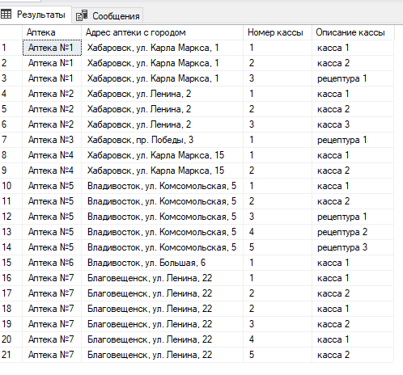
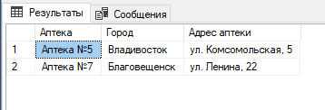
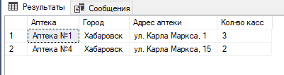
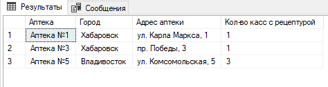
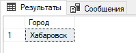

# Результаты выполнения тестового задания MS SQL

## Создание и наполнение БД
Скрипт создания БД: [create_tables.sql](create_tables.sql)

Скрипт наполнения БД: [populate_tables.sql](populate_tables.sql)
## Тестовые задания
### Задание №7
Вывести список всех касс со следующем столбцами: [Аптека], [Адрес аптеки с городом], [Номер кассы], [Описание кассы]

Код запроса
```
SELECT 
    D.name AS 'Аптека',
    CONCAT(C.name, ', ', D.address) AS 'Адрес аптеки с городом',
    CD.number AS 'Номер кассы', 
    CD.description AS 'Описание кассы'
FROM 
    cashdesk AS CD
INNER JOIN 
    drugstores AS D ON D.id = CD.drugstore_id 
INNER JOIN 
    cities AS C ON C.id = D.city_id;
```
Результат выполнения  

### Задание №8
Вывести список всех аптек, в которых более 3х касс, со столбцами [Аптека], [Город], [Адрес аптеки] 

Код запроса
```
SELECT
    D.name AS 'Аптека',
	C.name AS 'Город',
	D.address AS 'Адрес аптеки'
FROM drugstores AS D
INNER JOIN 
	cities AS C ON C.id = D.city_id 
INNER JOIN 
	cashdesk AS CD ON D.id = CD.drugstore_id 
GROUP BY 
	C.name, D.name, D.address
HAVING 
    COUNT(CD.id) > 3
ORDER BY 
    D.name;
```
Результат выполнения:  

### Задание №9
Вывести список всех аптек, расположенных по улице Карла Маркса, со столбцами [Аптека], [Город], [Адрес аптеки], [Кол-во касс] 

Код запроса
```
SELECT
    D.name AS 'Аптека',
	C.name AS 'Город',
	D.address AS 'Адрес аптеки',
    COUNT(CD.id) AS 'Кол-во касс'
FROM drugstores AS D
INNER JOIN 
	cities AS C ON C.id = D.city_id 
INNER JOIN 
	cashdesk AS CD ON D.id = CD.drugstore_id 
WHERE 
    D.address LIKE '%Карла Маркса%'
GROUP BY 
	C.name, D.name, D.address
ORDER BY 
    D.name;
```
Результат выполнения:  

### Задание №10
Вывести список всех аптек, в которых есть кассы с описанием «Рецептура», со столбцами [Аптека], [Город], [Адрес аптеки], [Кол-во касс с рецептурой]

Код запроса
```
SELECT
    D.name AS 'Аптека',
	C.name AS 'Город',
	D.address AS 'Адрес аптеки',
    COUNT(CD.id) AS 'Кол-во касс с рецептурой'
FROM drugstores AS D
INNER JOIN 
	cities AS C ON C.id = D.city_id 
INNER JOIN 
	cashdesk AS CD ON D.id = CD.drugstore_id 
WHERE 
    CD.description LIKE '%рецептура%'
GROUP BY 
	C.name, D.name, D.address
ORDER BY 
    D.name;
```
Результат выполнения:  

### Задание №11
Вывести список городов, в которых общее кол-во касс превышает 8, со столбцом [Город]

Код запроса
```
SELECT
	C.name AS 'Город'
FROM cities AS C 
INNER JOIN 
	drugstores AS D ON C.id = D.city_id 
INNER JOIN 
	cashdesk AS CD ON D.id = CD.drugstore_id 
GROUP BY 
	C.name
HAVING COUNT(CD.id) > 8;
```
Результат выполнения:  


Скрипты задач с 7 по 11 [tasks.sql](tasks.sql)

## Замечание к исполнению.
Задачи решались в лоб, без учёта увеличения количества записей.  

Для большого кол-ва записей (от 100к) при создании таблиц нужно реализовать полнотекстовой индекс для полей, по которым производится поиск.  
В нашем случае это ```PharmDB.drugstores.address``` и ```PharmDB.cashdesk.description```.

В разрезе реализации запросов нужно переходить на вложенные запросы, затем на "представления", затем часть работы по агрегированию данных стоит доверить внешнему скрипту.  
Особенности реализации зависят от набора "популярных данных"